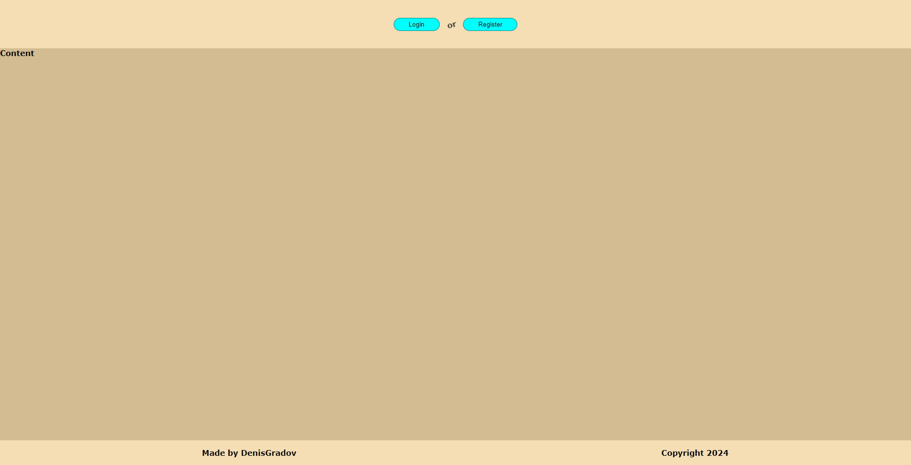
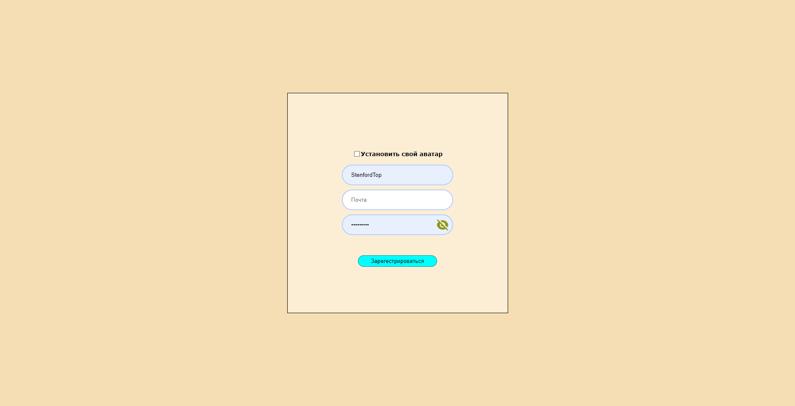
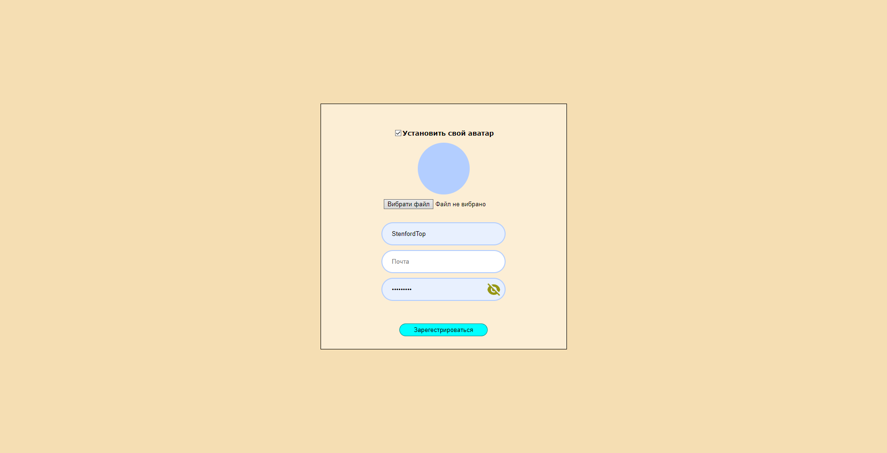
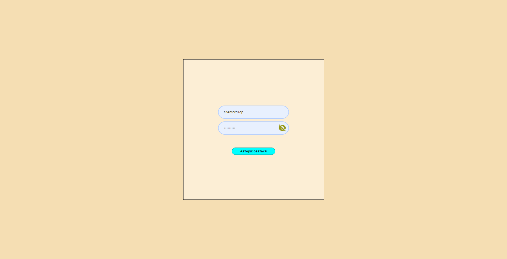

<a name="начало"></a>

# Сайт для авторизации (react + node + ts)

### Привет, я Денис, и я написал мини-проэкт: авторизация юзера на сайте. Юзер может зарегать себе аккаунт, а после - войти в него. Так же имеется логаут. Это весь функционал, проэкт - наработка для некст больших моих пэт проэктов.

### Ты можешь посмотреть [краткий видео-обзор](https://youtu.be/hiuK6X1QCuc), а можешь почитать этот пост

### Главы

- [Начало](#начало)
- [Главная страница](#Главная_страница)
- [Регистрация](#Регистрация)
- [Авторизация](#Авторизация)
- [Логаут](#Логаут)
- [API документация](#Документация_API)
- [Используемые компоненты](#компоненты)

<a name="Главная_страница"></a>

## Главная страница ([в начало](#начало))

### При запуске сайта - мы видем дефолтный макет сайта: шапка, мэин и футер. Сама страница разделена на отдельные компоненты, я старался делать все максимально правильно, юзая ts, при этом не ставя затычки any, у каждой константы/функции и т.д. свой тип. При посещении главной страницы сайта - делается запрос на бэкенд с проверкой ваших куков, если токен совпадет с 1 из аккаунтов в бд - вас запустит на сайт под аккаунт, иначе - покажет кнопки для авторизации/регистрации. Запросы на беке кстати адекватно разделены по файлам. Гавнокода все меньше и меньше)



<a name="Регистрация"></a>

## Регистрация ([в начало](#начало))

### Кликнув по регистрации - вас перекинет на соответствующую страницу. Тут юзер должен указать: свой аватар (опционально), логин, почту и пароль. По поводу аватара - он не обязателен, но если юзер хочет - жмет галочку на чексбоксе и прикрепляет фото. Фото должно быть одного из допустимых форматов + весить не более 2мб. По другим данным так же имеется валидация: русские символы нельзя, в почте должна быть @, больше 30 символов вводить нельзя. После указания данных - фронт отправляет запрос на бек, бек делает проверку данных (например, свободен ли ник/логин и т.д.). Если на беке будет ошибка - юзеру выведет ее над кнопкой регистрации (аналогичная система будет и в окне авторизации), а если все четко - юзера добавит в бд, аватар (если он был) - сохранится в uploads, а юзера редерекнет на главную страницу. Так же на основе логина юзера будет сгенерирован куки токен, который вместе с ответом установится юзеру на 30 дней




<a name="Авторизация"></a>

## Авторизация ([в начало](#начало))

### Тут все так же как и в регистрации: юзер вводит свой логин и пароль. Эти данные отправляются на бек, там бек проверяет, что ввел юзер: логин или почту, а дальше уже ищет в бд юзера по логину/почте (смотря что юзер указал) и сверяет пароль. Если ошибка - выводит юбзеру, если все четко - устанавливает юзеру куки на 30 дней через ответ + редеректит на главную страницу


<br/>
<a name="Логаут"></a>

## Логаут ([в начало](#начало))

### У сайта имеется логаут. При переходе на /logout - открывается компонент логаут, который отправляет запрос на бек + редеректит на главную. Бек же устанавливает юзеру куки с пустым токеном (по факту обнуляя его)

<a name="компоненты"></a>

## Используемые компоненты ([в начало](#начало))

| Название компонента           | Значение                            |
| ----------------------------- | ----------------------------------- |
| App.js                        | Связка всех компонентов             |
| HomePage/HomePage.jsx         | Связка компонентов главной страницы |
| HomePage/Header.jsx           | Шапка мэйна                         |
| HomePage/Main.jsx             | Главный раздел мэйна                |
| HomePage/Footer.jsx           | Футер мэйна                         |
| Login/Login.jsx               | Авторизация юзера                   |
| Logout/Logout.jsx             | Компонент для логаута юзера         |
| Registration/Registration.jsx | Регистрация юзера                   |
| Elements/Button/Button.jsx    | Компонент создающий кнопку          |
| Elements/Input/Input.jsx      | Компонент создаюший инпут           |

<a name="Документация_API"></a>

## API документация ([в начало](#начало))

### Базовый url указывается в .env в корне сайта, в моем случае это http://localhost:3000

<details>
  <summary>POST /api/auth/verifyToken</summary>
  <h2>Проверка токена пользователя для аутентификации</h2>

  <h3><strong>Тело запроса:</strong></h3>

```json
{
  //пустое тело
}
```

  <h3><strong>Ответ сервера:</strong></h3>
  
```json
{
  "authorized": true // true, если пользователь авторизован, иначе false
}

````

</details>
<details>
  <summary>POST /api/auth/logout</summary>
  <h2>Выход пользователя из системы</h2>

  <h3><strong>Тело запроса:</strong></h3>

```json
{
  //пустое тело
}
````

  <h3><strong>Ответ сервера:</strong></h3>
  
```json
"Logout ok" 
```

</details>
<details>
  <summary>POST /api/auth/registration</summary>
  <h2>Регистрация нового пользователя</h2>

  <h3><strong>Тело запроса:</strong></h3>

```json
{
  "login": "user_login", // Логин пользователя
  "email": "user_email", // Электронная почта пользователя
  "password": "user_password", // Пароль пользователя
  "userAvatar": "user_avatar" // Аватар пользователя (опционально)
}
```

  <h3><strong>Ответ сервера:</strong></h3>
  
```json
"Registration successfully"
```
</details>
<details>
  <summary>POST /api/auth/login</summary>
  <h2>Вход пользователя в систему</h2>

  <h3><strong>Тело запроса:</strong></h3>

```json
{
  "login": "user_login_or_email", // Логин или электронная почта пользователя
  "password": "user_password" // Пароль пользователя
}
```

  <h3><strong>Ответ сервера:</strong></h3>
  
```json
"Login successfully" // Сообщение о успешном входе пользователя
```
</details>
